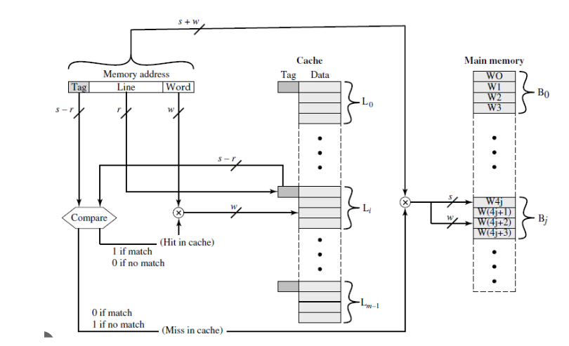

# Proyecto 3: Sistema de jerarquía de memoria entre una memoria principal y una memoria caché
### EL3310 - Diseño de Sistemas Digitales
### Escuela de Ingeniería Electrónica
### Tecnológico de Costa Rica

<br/><br/>

## Objetivos del sistema a desarrollar
Este proyecto consiste en construir un sistema de jerarquía de memoria entre una memoria principal y una memoria caché, con las siguientes características:
erarquía de memoria de dos niveles: la memoria caché y la memoria principal.
• La memoria caché debe ser de 1024 Bytes de datos, mientras que la memoria principal debe ser de 65KiB. La memoria como un todo tendrá 16 bits de direcciones.
• Los bloques de memoria deben ser de 256 bits, la palabra a leer/escribir es de 32 bits y la memoria se puede direccionar por byte.
• La caché implementa mapeo directo.
• Las escrituras pueden hacerse por Write-Through o Write-Back, a gusto de cada grupo.
• La caché debe tener bit de válido (y bit de Dirty si usan Write-Back).
• Debe mostrar una simulación del procesador en SystemVerilog probando caché hits y caché misses. 


Para este proyecto se utilizó como guía el siguiente diagrama:
## Diagrama del sistema de jerarquía



## Módulo address
El módulo address, es un decodificador de direcciones de una caché de mapeo directo. Su función principal es tomar una dirección de memoria física completa de 16 bits (addr) y dividirla en sus tres componentes esenciales para la operación de la caché: el Tag (etiqueta), el Index (índice de línea) y el Word Selector (selector de palabra/offset). Estos campos se definen mediante parámetros configurables: 5 bits para el índice (INDEX_W), lo que implica 32 líneas de caché; y 5 bits para el offset (OFFSET_W), lo que indica bloques de 2^5=32 Bytes, con un selector de palabra de 3 bits (word_sel) que identifica una palabra de 32 bits dentro de ese bloque. Los 6 bits restantes forman el campo Tag, que se usa para verificar si la línea de caché indexada contiene los datos correctos.


## Módulo caché
El módulo cache implementa la memoria de almacenamiento principal de una caché de mapeo directo configurable. Este módulo gestiona tres arrays síncronos: el tag_array (almacena las etiquetas para verificar la pertenencia de los datos), el valid_array (indica si la línea de caché contiene datos válidos) y el data_array (la memoria de datos real organizada en líneas y bloques de palabras). Utiliza la entrada index para seleccionar la línea de caché y word_sel para seleccionar una palabra dentro del bloque. La lectura es asíncrona a través del multiplexado directo del index, mientras que la escritura de datos y tags se realiza de forma síncrona controlada por los habilitadores we_data y we_tag, siendo fundamental para cargar nuevos bloques desde la memoria principal o para manejar escrituras en la propia caché.


## Módulo main_memory

El módulo main_memory modela el comportamiento de una Memoria de Acceso Aleatorio (RAM) principal y un retardo de acceso fijo. Internamente, contiene un gran array (mem) de 216=65,536 palabras de 32 bits (DATA_W) y se inicializa con valores secuenciales. La característica clave de este módulo es la latencia programable (LATENCY = 8 ciclos por defecto) que simula el tiempo real que tarda la memoria en responder. Cuando se recibe una solicitud de acceso (req es alto) y la memoria está disponible (ready es alto), la señal ready baja para indicar ocupado. Un contador (wait_cnt) maneja la latencia, y solo después de LATENCY ciclos el módulo completa la operación: si la operación es de escritura (we es alto), el dato (wdata) se guarda; para cualquier operación, el dato leído se coloca en rdata, y se levanta la señal done (y ready vuelve a ser alta) para indicar que el resultado está disponible.


## Waveform sistema completo


## Consola


## Codigos de consola

### Cpu multiciclo
```
vcs -kdb -sverilog -lca -Mupdate -debug_all +vcs+flush+all +warn=all -timescale=1ns/10ps -full64 \
-P ${VERDI_HOME}/share/PLI/VCS/linux64/novas.tab ${VERDI_HOME}/share/PLI/VCS/linux64/pli.a \
-CFLAGS -DVCS module/*.sv tb/tb_sistema_top.sv 

./simv -gui
```
