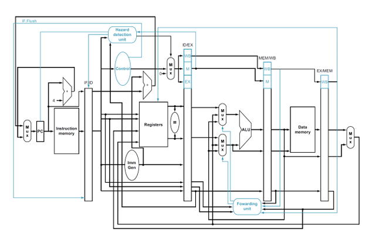

# Proyecto 2: Implementación de un procesador multiciclo con pipeline basado en `rv32i`
### EL3310 - Diseño de Sistemas Digitales
### Escuela de Ingeniería Electrónica
### Tecnológico de Costa Rica

<br/><br/>

## Procesador multiciclo con pipeline
Este proyecto consiste en construir un microprocesador en SystemVerilog. El procesador 
debe tener las siguientes características:
- Microprocesador multiciclo de 5 etapas con pipeline. 
- Debe incluir unidad de detección de riesgos (Riesgos de Datos y Riegos de Control) 
y unidad de adelantamiento. 
- El procesador debe ser capaz de correr todas las instrucciones del estándar RV32I 
(menos las FENCE, PAUSE, ECALL, EBREAK). 
- Debe mostrar una simulación del procesador en SystemVerilog corriendo un 
programa de su gusto. La presentación puede ser virtual o presencial, con cita al 
correo (Asunto: Presentación Proyecto 2). La entrega del código puede ser en un 
repositorio en github o en .zip al TEC Digital. 


Usted desarrollará un procesador multiciclo con pipeline como el que muestra en la siguiente figura.

"Diagrama de bloques de un procesador multiciclo con pipeline basado en `rv32i`"


Usted deberá implementar las siguientes instrucciones del [_greencard_](https://tecdigital.tec.ac.cr/dotlrn/classes/E/EL3310/S-1-2025.CA.EL3310.2/file-storage/view/materiales%2Fgreencard.pdf):

```asm
lw
sw
sll, slli, srl, srli, sra, srai
add, addi, sub
xor, xori, or, ori, and, andi
beq, bne, blt, bge
slt, slti, sltu, sltui
jal, jalr
```


## Diagrama del Pipelined


## Codigos de consola

### Hazard unit

```
iverilog -g2012 -o sim/hazard_testbench sim/tb_hazard_unit.sv src/Hazard_det_unit.sv

vvp sim/hazard_testbench

gtkwave sim/vcd/tb_hazard_unit.vcd
```

### Forwarding unit

```
iverilog -g2012 -o sim/forward_testbench sim/tb_forwarding_unit.sv src/Forwarding_unit.sv

vvp sim/forward_testbench

gtkwave sim/vcd/tb_forwarding_unit.vcd
```

### Cpu multiciclo
```
iverilog -g2012 -o cpu_tb.vvp     tb/tb_cpu_multiciclo.sv     module/cpu_multiciclo.sv     module/control_unit.sv     module/datapath_mul.sv     module/Hazard_det_unit.sv     module/Forwarding_unit.sv     module/datapath_fetch_decode.sv     module/datapath_execute.sv     module/datapath_mem.sv     module/register_id_ex.sv     module/register_if_id.sv     module/register_mem_wb.sv     module/register_ex_mem.sv     module/pc.sv     module/instruction_memory.sv     module/data_memory.sv     module/ImmGen.sv     module/register_bank.sv     module/ALU.sv     module/adder.sv     module/mux21.sv     module/mux31.sv

vvp cpu_tb.vvp

gtkwave cpu_multiciclo_tb.vcd
```
